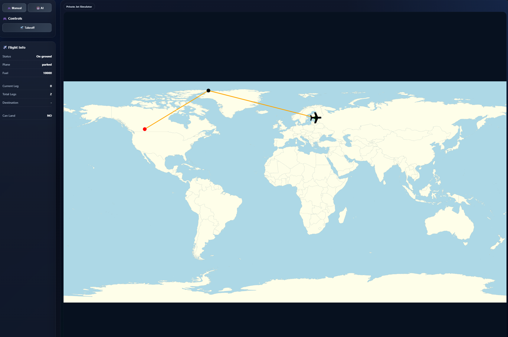
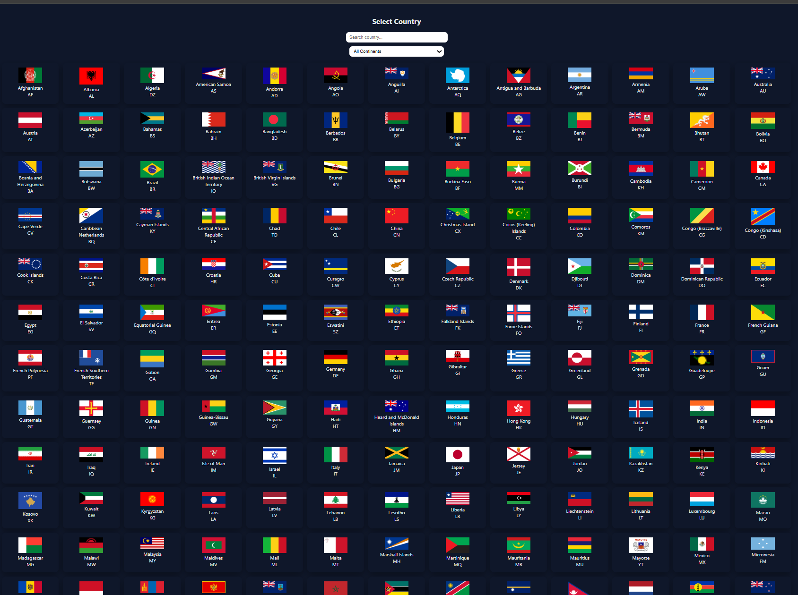
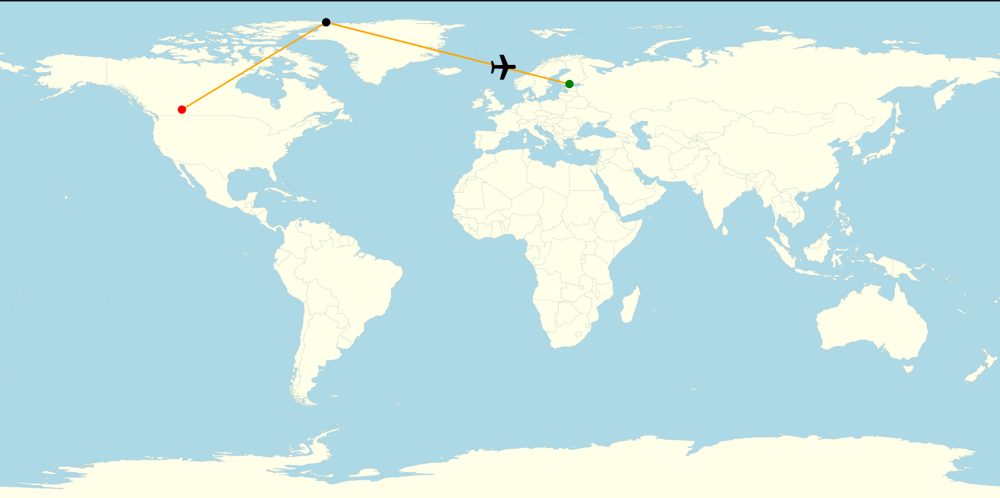
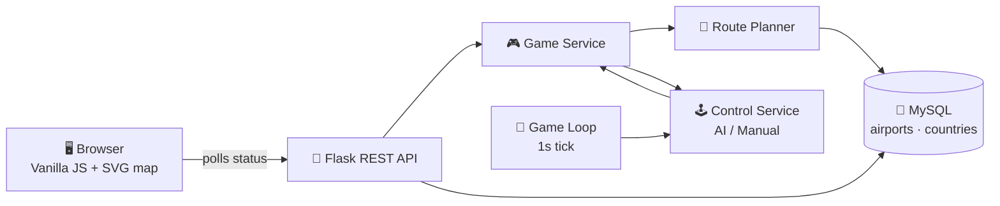

<div align="center">

# ✈️ Pilot Flight Planning System

**A browser-based flight simulation game where you plan a route between real airports, manage fuel, and land the plane — either by autopilot or by hand.**

<a href="https://pilot-flight-planning-system.vercel.app"></a>
<a href="https://pilot-flight-planning-system.onrender.com"></a>

<br/>


<br/><br/>

<!-- ضع لقطة شاشة للعبة هنا / Add a gameplay screenshot here -->


</div>

---

## Screenshots

<div align="center">

**Country and airport selection** — every country with airports in the database, searchable and filterable by continent.



<br/>

**A planned route** — green is the departure airport, black is an automatically inserted refuelling stop, red is the final destination. The aircraft moves along the orange line in real time.



</div>

---

## What it is

Pick a departure airport and a destination anywhere in the world. The backend plans the route, checks whether your jet can actually make it, and inserts refuelling stops when the distance is too long. Then you fly it — watching the plane cross an SVG world map leg by leg, landing at each stop, refuelling, and taking off again until you arrive.

The interesting part isn't the graphics. It's that **the flight rules are real constraints**: fuel burns per kilometre, a reserve is always held back, and a route is rejected outright if no reachable refuelling airport exists along the way.

## Features

| | |
|:--|:--|
| 🌍 **Real airport data** | Countries and airports come from a MySQL database, searchable and filterable by continent. |
| 🧭 **Automatic route planning** | Great-circle distances, fuel range checks and up to two refuelling stops inserted automatically. |
| ⛽ **Fuel system** | Fuel burns per kilometre with a 30% safety reserve. Refuelling only happens at large or medium airports. |
| 🤖 **Autopilot mode** | A background game loop moves the plane toward its target every tick. |
| 🎮 **Manual mode** | Take the controls with the arrow keys — forward, bank left, bank right. |
| 🛬 **Landing decisions** | The plane arms for landing within 50 km of the target; you decide when to touch down. |
| 🗺️ **Live SVG map** | Route, stops, destination and aircraft position are rendered and updated in real time. |

---

## How it works



**The flight loop, step by step:**

1. **Select** a departure and a destination airport in the browser.
2. **Plan** — the backend computes the great-circle distance and decides whether the jet can fly it directly.
3. **Refuel stops** — if the leg is too long, it searches for a large or medium airport that is both reachable and closer to the destination, and inserts it into the plan.
4. **Fly** — in AI mode a background thread advances the plane every second; in manual mode each arrow key press moves it one step.
5. **Land** — within 50 km of the target the plane arms for landing and the Land button appears.
6. **Repeat** — refuel, take off for the next leg, until the final destination is reached.

### Flight model

| Parameter | Value |
|:--|:--|
| Max fuel | 10,000 units |
| Fuel burn | 2 units / km → **5,000 km** absolute range |
| Safety reserve | 30% of tank |
| Max direct leg | ~2,100 km before a stop is required |
| Max legs per trip | 3 |
| Landing arm radius | 50 km |
| Autopilot speed | 100 km per tick (1 s) |

---

## Tech Stack

**Backend** — Python · Flask · Flask-CORS · MySQL Connector · Gunicorn
**Frontend** — Vanilla JavaScript (ES modules) · SVG · CSS — no framework, no build step
**Database** — MySQL (airport and country tables)
**Deployment** — Render (API) · Vercel (client)

---

## Project structure

```
backend/
├── app.py                    # Flask app, CORS, blueprint registration
├── db.py                     # MySQL connection helper
├── routes/
│   ├── game_routes.py        # /game/... endpoints
│   └── Location_Routes.py    # /locations/... endpoints
├── services/
│   ├── game_service.py       # Game lifecycle: start, takeoff, land, status
│   ├── plane_service.py      # Route planner with refuel logic
│   ├── airport_service.py    # Airport lookup and refuel-stop selection
│   ├── control_service.py    # AI and manual movement decisions
│   ├── location_service.py   # Countries and airports by country
│   ├── game_loop.py          # Background thread, 1s tick
│   └── sql.py                # All SQL queries
├── game/
│   ├── game.py               # Core game state machine
│   ├── game_manager.py       # In-memory registry of active games
│   ├── plane.py              # Position, fuel, takeoff/landing
│   ├── airport.py            # Airport entity
│   └── pilot.py              # Pilot entity
└── utils/
    └── helpers.py            # Haversine distance

client/
├── index.html                # Map and cockpit view
├── location.html             # Country and airport selection
├── css/
└── js/
    ├── api/                  # Fetch wrappers
    ├── core/                 # Polling loop, trip completion
    ├── map/                  # Projection, rendering, controller
    └── ui/                   # Control panel, keyboard controls
```

---

## Getting Started

### Prerequisites

- Python 3.10+
- MySQL with an `airport` and `country` table (the [OurAirports](https://ourairports.com/data/) dataset works directly)

### Backend

```bash
git clone https://github.com/Abdullah22-22/Pilot-Flight-Planning-System.git
cd Pilot-Flight-Planning-System

python -m venv venv
source venv/bin/activate        # Windows: venv\Scripts\activate

pip install -r requirements.txt
```

Create a `.env` file in the project root:

```env
DB_HOST=localhost
DB_PORT=3306
DB_USER=your_user
DB_PASSWORD=your_password
DB_NAME=flight_game
```

Then run:

```bash
python app.py
```

The API starts on `http://127.0.0.1:5000`.

### Frontend

In `client/js/api/baseApi.js`, point `BASE_URL` at your local API:

```js
const BASE_URL = "http://127.0.0.1:5000";
```

Then serve the `client` folder with any static server — for example the **Live Server** extension in VS Code — and open `location.html`.

---

## API Reference

### Locations

| Method | Endpoint | Description |
|:--|:--|:--|
| `GET` | `/locations/countries` | All countries that have airports |
| `GET` | `/locations/airports/<country_code>` | Airports in a country, largest first |

### Game

| Method | Endpoint | Description |
|:--|:--|:--|
| `POST` | `/game/<pilot_id>/start` | Start a session at a departure airport |
| `POST` | `/game/<pilot_id>/preview` | Plan a route without taking off |
| `POST` | `/game/<pilot_id>/takeoff` | Initial takeoff, or takeoff for the next leg |
| `POST` | `/game/<pilot_id>/land` | Land at the current target |
| `GET` | `/game/<pilot_id>/status` | Full game state for the UI |
| `GET` | `/game/<pilot_id>/route` | Route coordinates for the map |
| `POST` | `/game/<pilot_id>/mode/ai` | Switch to autopilot |
| `POST` | `/game/<pilot_id>/mode/manual` | Switch to manual control |
| `POST` | `/game/<pilot_id>/manual/move` | Move one step (`FORWARD` / `LEFT` / `RIGHT`) |
| `DELETE` | `/game/<pilot_id>` | End the session |

<details>
<summary><b>Example — starting a game</b></summary>

```http
POST /game/1/start
Content-Type: application/json

{
  "pilot_name": "Abdullah",
  "plane_id": "JET-001",
  "airport_code": "EFHK"
}
```

</details>

---

## Controls

| Key | Action |
|:--|:--|
| `↑` | Fly forward |
| `←` | Bank left |
| `→` | Bank right |

Manual mode must be enabled first — arrow keys are ignored while the autopilot is flying.

---

## What I learned building this

- Modelling a **state machine** (parked → flying → arming → landed → refuelled → next leg) so that no invalid transition is reachable from the API.
- Keeping domain logic in plain Python classes and out of the Flask layer, so the rules can be reasoned about on their own.
- Running a **background thread** alongside a Flask app without letting one bad tick take the whole loop down.
- Working with **geospatial data** — the haversine formula, equirectangular projection onto an SVG viewBox, and why a straight line on a flat map isn't a straight line in the air.

---

<div align="center">

**Built by [Abdullah Al-Tameemi](https://github.com/Abdullah22-22)** · Software Engineering student @ Metropolia UAS, Helsinki

<a href="https://pilot-flight-planning-system.vercel.app"></a>

</div>
